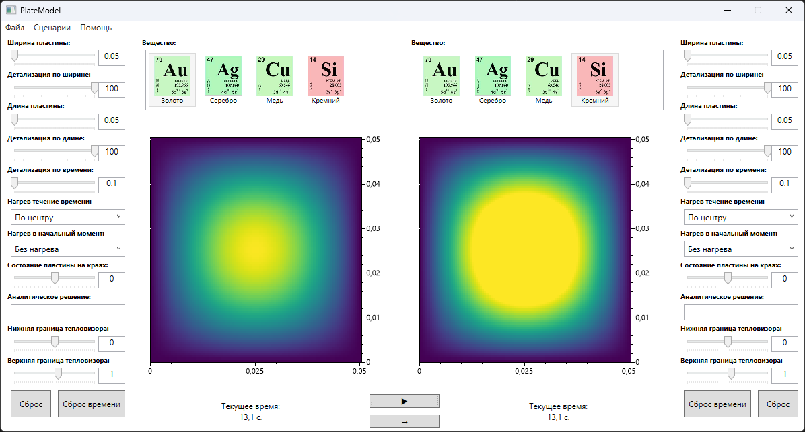

# PlateModel

This project is extension of [NumericalPlate](https://github.com/morphin17/NumericalPlate) project. 

PlateModel implements modeling of two plates with the ability to individually configure the parameters described above for each plate. The temperature distribution on the wafer is visualized using a heat map. This solution makes it possible to compare different scenarios of impact on the plates.

App has four scenarios for heating or cooling plates of different materials as simulation examples.

